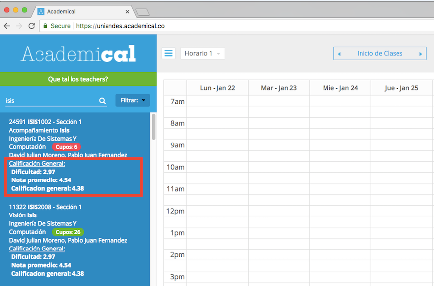

# IZY

Extensión de Chrome para tener la funcionalidad de [Los Estudiantes](https://losestudiantes.co/) en [Academical](https://uniandes.academical.co/).
Permite tener las calificaciones de los profesores sin salir de la página en la que se está haciendo el horario.

  

## INSTALACIÓN
Desde Chrome dar click en este [link](https://chrome.google.com/webstore/detail/ejlednlcppjjknhelilppmccfmbmmlhb) o entrar a [Chrome Web Store](https://chrome.google.com/webstore/) y buscar Izy.

## CÓMO FUNCIONA
Una vez instalada desde [Chrome Web Store](https://chrome.google.com/webstore/detail/ejlednlcppjjknhelilppmccfmbmmlhb) (por ahora solo existe para los usuarios de Chrome), solo es necesario entrar a la página de [Academical](https://uniandes.academical.co/),
escribir algo en el buscador y cuando carguen los resultados oprimir el boton "Qué tal los teachers?". Pasarán algunos segundos e iran apareciendo las
calificaciones de cada uno de los profesores bajo los cursos (ver imagen).

## CÓMO APORTAR
Esto es y siempre será Open Source, así que cualquiera puede aportar. Lo ideal sería poder hacer las versiones respectivas para los demas
navegadores: Firefox, Opera, Safari y Edge. 

